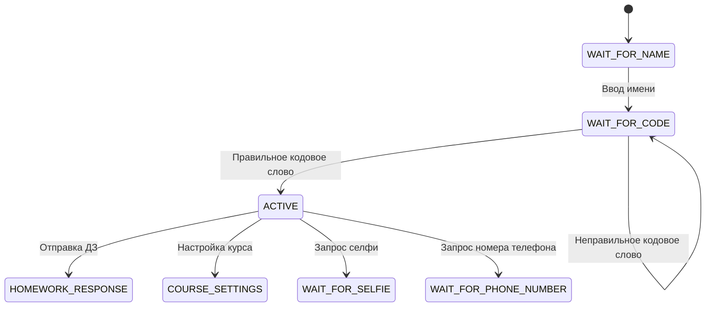

## Разбор состояний и логики работы программы

В данном коде реализован бот Telegram, который управляет состояниями пользователей и обрабатывает их взаимодействия. Основная логика работы заключается в использовании состояний для определения текущего этапа взаимодействия с пользователем. Ниже приведен подробный разбор состояний и функций, связанных с ними.

---

### Список состояний

| **Состояние**               | **Описание**                                                                                 |
|------------------------------|---------------------------------------------------------------------------------------------|
| `WAIT_FOR_NAME`             | Ожидание ввода имени пользователя.                                                          |
| `WAIT_FOR_CODE`             | Ожидание ввода кодового слова для активации курса.                                          |
| `ACTIVE`                    | Основное состояние работы бота (обработка сообщений, кнопок, документов и т.д.).           |
| `HOMEWORK_RESPONSE`         | Состояние для обработки ответов на домашние задания.                                        |
| `COURSE_SETTINGS`           | Состояние для настройки параметров курса.                                                  |
| `WAIT_FOR_SUPPORT_TEXT`     | Ожидание ввода текста для поддержки.                                                        |
| `WAIT_FOR_SELFIE`           | Ожидание загрузки селфи от пользователя.                                                   |
| `WAIT_FOR_DESCRIPTION`      | Ожидание ввода описания от пользователя.                                                    |
| `WAIT_FOR_CHECK`            | Ожидание проверки данных.                                                                   |
| `WAIT_FOR_GIFT_USER_ID`     | Ожидание ввода идентификатора пользователя для подарка.                                     |
| `WAIT_FOR_PHONE_NUMBER`     | Ожидание ввода номера телефона пользователя.                                                |

---

### Основное состояние: `ACTIVE`

В состоянии `ACTIVE` бот выполняет следующие действия:

| **Обработчик**                          | **Описание**                                                                                       |
|-----------------------------------------|---------------------------------------------------------------------------------------------------|
| `MessageHandler(filters.TEXT & ~filters.COMMAND, handle_text_message)` | Обрабатывает текстовые сообщения, которые не являются командами.                                  |
| `CallbackQueryHandler(button_handler)`  | Обрабатывает нажатия на кнопки в интерфейсе Telegram (callback-запросы).                          |
| `MessageHandler(filters.Document.IMAGE, handle_document)`             | Обрабатывает изображения, отправленные пользователем как документы.                               |
| `CallbackQueryHandler(self_approve_homework, pattern=r'^self_approve_\d+$')` | Обрабатывает подтверждение домашнего задания самим пользователем (по шаблону callback-запроса).   |
| `CallbackQueryHandler(approve_homework, pattern=r'^approve_homework_\d+_\d+$')` | Обрабатывает подтверждение домашнего задания администратором (по шаблону callback-запроса).       |

---

### Логика перехода между состояниями

1. **Начало работы:**
   - Пользователь вводит своё имя → переходит в состояние `WAIT_FOR_NAME`.
   - После успешного ввода имени бот запрашивает кодовое слово → переход в состояние `WAIT_FOR_CODE`.

2. **Активация курса:**
   - Если введено правильное кодовое слово, курс активируется, и пользователь переходит в состояние `ACTIVE`.
   - Если кодовое слово неверное, остаётся в состоянии `WAIT_FOR_CODE`.

3. **Работа в состоянии ACTIVE:**
   - Пользователь может взаимодействовать с ботом через текстовые сообщения, кнопки и отправку файлов.
   - Бот обрабатывает действия в зависимости от типа сообщения или callback-запроса.

4. **Дополнительные состояния:**
   - Например, при отправке селфи или номера телефона бот переходит в соответствующие состояния (`WAIT_FOR_SELFIE`, `WAIT_FOR_PHONE_NUMBER`) и ожидает выполнения действий.

---

### Таблица функций

| **Функция**                  | **Описание**                                                                                 |
|------------------------------|---------------------------------------------------------------------------------------------|
| `handle_user_info()`         | Обрабатывает ввод имени пользователя и сохраняет его в базу данных.                         |
| `handle_code_words()`        | Проверяет введённое кодовое слово и активирует курс при успешной проверке.                  |
| `get_current_lesson()`       | Отправляет материалы текущего урока пользователю (текст урока и связанные файлы).           |
| `process_lesson()`           | Обрабатывает текст урока и отправляет связанные с ним файлы (с учётом задержек).            |
| `load_course_data()`         | Загружает данные о курсах из JSON-файла.                                                    |
| `load_delay_messages()`      | Загружает список сообщений о задержках из текстового файла.                                 |

---

### Пример сценария работы

1. Пользователь запускает бота:
   - Бот запрашивает имя пользователя → состояние: `WAIT_FOR_NAME`.

2. Пользователь вводит имя:
   - Бот сохраняет имя и запрашивает кодовое слово → состояние: `WAIT_FOR_CODE`.

3. Пользователь вводит кодовое слово:
   - Если кодовое слово правильное:
     - Курс активируется.
     - Пользователь получает первый урок.
     - Переход в состояние: `ACTIVE`.
   - Если неправильное:
     - Бот просит повторить ввод → остаётся в состоянии: `WAIT_FOR_CODE`.

4. В состоянии `ACTIVE` пользователь может:
   - Получать уроки.
   - Отправлять домашние задания.
   - Взаимодействовать с кнопками.

---

### Пример визуализации переходов между состояниями

---

### Итог

Состояния позволяют организовать логику работы бота таким образом, чтобы он мог корректно обрабатывать разные этапы взаимодействия с пользователем (например, активацию курса, получение уроков или отправку домашнего задания). Код хорошо структурирован благодаря использованию обработчиков событий (`MessageHandler`, `CallbackQueryHandler`) и системы состояний (`ConversationHandler`).

Citations:
[1] https://ppl-ai-file-upload.s3.amazonaws.com/web/direct-files/13592574/5755e4c2-efaa-4702-be10-d0b38d85cf6a/paste.txt

---
Answer from Perplexity: pplx.ai/share